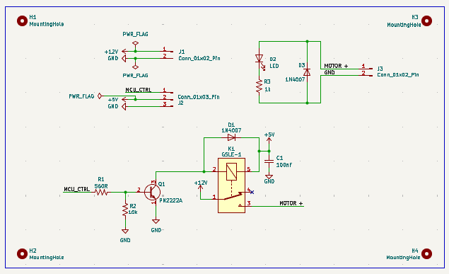
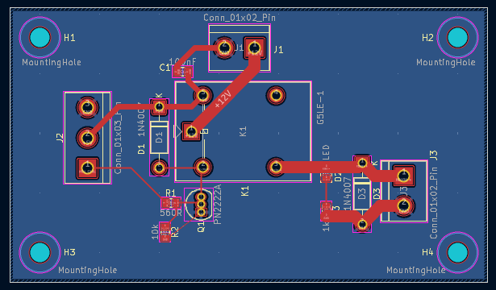
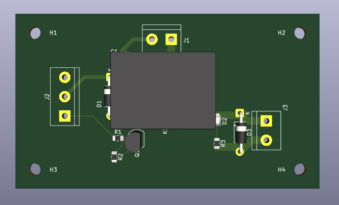

# 5V-Relay-Driver-PCB

## Project Overview

This project implements a 5V MCU-controlled relay driver PCB designed in KiCad for switching a 12V DC motor load. The relay coil is driven using a P2N2222A NPN transistor operating in saturation mode. A flyback diode is included across the relay coil to suppress inductive voltage spikes and protect the transistor during turn-off.

The project covers the complete hardware design flow including schematic capture, LTspice simulation, PCB layout, ERC/DRC verification, BOM generation, and manufacturing file generation.

---

## Design Specifications

| Parameter           | Value                   |
| ------------------- | ----------------------- |
| MCU Control Voltage | 5 V                     |
| Relay               | Omron G5LE-1 DC5        |
| Relay Coil Voltage  | 5 V                     |
| Relay Coil Current  | 79.4 mA                 |
| Load Voltage        | 12 V DC                 |
| Load Type           | DC Motor                |
| Switching Device    | P2N2222A NPN Transistor |
| Base Resistor       | 1 kΩ                    |
| Protection          | Flyback Diode           |
| PCB Layers          | 2-Layer PCB             |
| Design Tool         | KiCad                   |
| Simulation Tool     | LTspice                 |

---

## Circuit Operation

The MCU output drives the base of a P2N2222A transistor through a 560Ω resistor. When the MCU output goes HIGH, the transistor enters saturation and energizes the relay coil. The relay contacts then connect the 12V supply to the motor load.

A flyback diode connected across the relay coil suppresses the back-EMF generated when the relay is switched OFF, protecting the transistor from high-voltage transients.

---

## Schematic

*Relay driver schematic showing MCU interface, transistor driver stage, relay coil protection diode, status LED, and motor switching contacts.*

---

## PCB Layout

### Top Layer

*Top layer PCB layout generated in KiCad.*

### 3D View

*3D rendering of the completed relay driver PCB.*

---

## LTspice Simulation Results

### Relay Coil Current Verification

*Measured relay coil current ≈ 78.4 mA, validating proper energization of the Omron G5LE-1 relay.*

---

### Transistor Saturation Verification

*Measured VCE(sat) ≈ 89 mV, confirming that the P2N2222A transistor operates in saturation and minimizes conduction losses.*

---

### Base and Collector Current Verification

*Base current ≈ 7.4 mA and collector current ≈ 78.4 mA verify correct transistor drive and base resistor selection.*

---

### Flyback Diode Verification

*Flyback diode suppresses the inductive voltage spike generated by the relay coil during turn-off, protecting the switching transistor.*

---

## Design Verification

### Electrical Rules Check (ERC)

✔ No ERC errors

### Design Rules Check (DRC)

✔ No DRC violations

### Manufacturing Outputs Generated

✔ Gerber Files

✔ Drill Files

✔ Drill Report

✔ Drill Map

✔ Bill of Materials (BOM)

---

## Key Skills Demonstrated

* Schematic Capture
* Relay Driver Design
* Transistor Switching Circuits
* Component Selection
* LTspice Simulation
* PCB Layout Design
* ERC and DRC Verification
* BOM Generation
* Gerber Generation
* Hardware Design Documentation
* Manufacturing Output Preparation

---

## Author

Sri Harshini N

Hardware Design | PCB Design | Electronics Engineering

